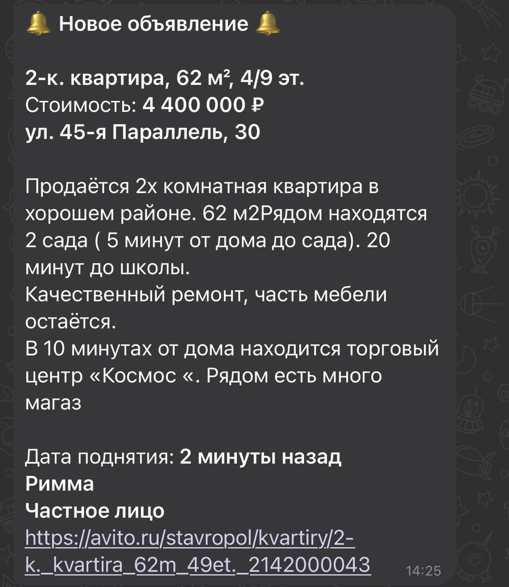
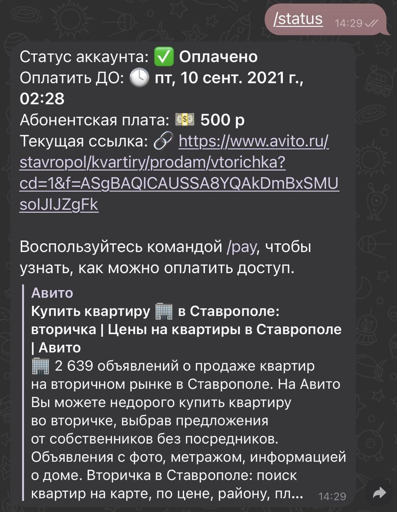

# **Telegram бот Сканер недвижимости [@realtyscanbot](https://t.me/realtyscanbot)**

Пользователь отправляет ссылку на Avito, в которой содержатся настройки поиска. Бот обновляет эту ссылку раз в 2 минуты и если появились новые объявления, то отправляет новые объявления пользователю в чат.

# Используемые библиотеки
- [telegraf 3.38](https://github.com/telegraf/telegraf/tree/3.38.0)
- [amqplib](https://github.com/squaremo/amqp.node)
- [axios](https://github.com/axios/axios)
- [cheerio](https://github.com/cheeriojs/cheerio)
- [dotenv](https://github.com/motdotla/dotenv)
- [https-proxy-agent](https://github.com/TooTallNate/node-https-proxy-agent)
- [mongodb](https://github.com/mongodb/mongo)

# Команды пользователя

`/start` - запуск Сканера

`/stop` - остановка Сканера

`/status` - текущий статус аккаунта пользователя

`/pay` - информация об оплате услуг

`/help` - все доступные команды

# Пример сообщения с новым объявлением

# Пример сообщения с информацией о текущем статусе аккаунта

# Команды админа

`/glu - [кол-во юзеров с конца]` - выводит информацию по пользователям. Новые пользователи будут в начале

`/gu - [userId]` - выводит информацию по определенному пользователю

`/au - [userId]` - ручной процессинг оплаты. Добавляет 30 суток к полю nextpay. Возвращает обновлённую запись

`/ap - [userId] - [Кол-во часов]` - добавление N количества бесплатных часов для пользования. Возвращает обновлённую запись

`/all - [Текст]` - отправить сообщение всем пользователям из базы данных

`/gp` - выводит информацию по всем прокси из базы данных

`/ban - [userId]` - бан пользователя

`/unban - [userId]` - разбан пользователя